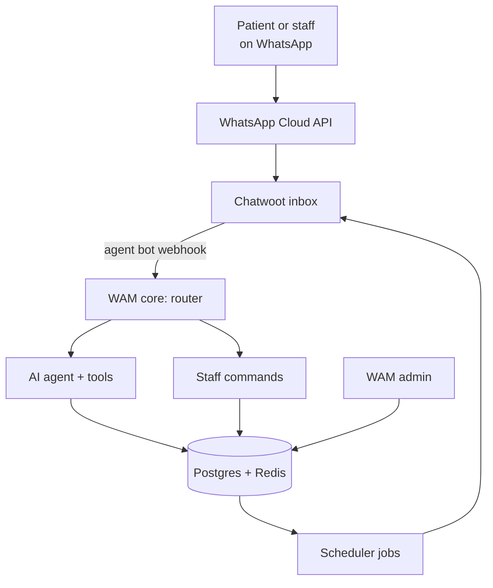
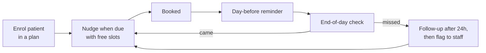

# WAM Build Spec

Sep 24, 2026 · @Aadvik

## Overview

WAM is an assistant on a business's official WhatsApp number that answers customers, books visits and brings people back when their next visit is due. Version 1 targets clinics where treatment takes several visits: dental, skin, physiotherapy and paediatrics.

The pitch is "patients finish their treatment". Practo already brings doctors new patients, so WAM focuses on returning ones.

**Build principles**

- One shared engine, with industry packs on top: clinic first, then institute, then business.
- Fork what exists (Chatwoot for the inbox and WhatsApp connection); build only what makes WAM different.
- Plain code makes every booking decision. The AI only understands messages and writes replies.
- Staff run everything from their own WhatsApp; the web admin is for setup and reports.
- Anything that cancels or messages many people needs a YES confirmation.

## Architecture

WAM has four parts. Cal.diy is dropped from version 1: it lacks treatment plans, reminders and team scheduling, and a simple slot engine inside WAM core is about a day's work.

| Part | What it does | Built with | Build or fork |
| --- | --- | --- | --- |
| Chatwoot | WhatsApp connection, shared inbox, handing chats to staff, many clinics on one install | Ruby on Rails, Vue, Postgres, Redis | Fork and rebrand to WAM; configure, don't rewrite |
| WAM core | Router, AI agent, slot engine, schedules, reminders, staff commands | Python, FastAPI, arq job queue | Build |
| WAM admin | Clinic setup, patients and plans, today's list, reports | Next.js | Build |
| Data | Clinics, contacts, schedules, appointments, logs, jobs | Postgres, Redis | Shared services |



A message arrives in Chatwoot, which sends it to WAM core by webhook. WAM core decides whether the sender is staff or a patient, runs the right tools, and replies through Chatwoot's API. Scheduled messages (reminders, nudges, follow-ups) also go out through Chatwoot, so every conversation stays in one inbox.

**AI model:** a small, fast model such as Claude Haiku, called through its API. The AI picks tools and writes replies; code checks every slot before booking.

## Shared engine and data model

Every table uses generic names so the institute and business packs fit without a rewrite. Each business has a `type` (clinic, institute or business) that decides which pack loads.

| Table | Holds | Used by |
| --- | --- | --- |
| `businesses` | Name, type, WhatsApp inbox, hours, language, settings | All |
| `staff` | Name, phone, role, PIN hash, permissions | All |
| `roles` | Role name and allowed commands, set per business | All |
| `contacts` | Name, phone, language, consent date, linked contacts (e.g. parent) | All |
| `groups` + `group_members` | Batches, patient lists, customer segments | All |
| `resources` | Who or what gets booked: doctor, teacher, stylist, room | All |
| `availability` | Working hours, slot length, breaks, leave per resource | All |
| `schedule_templates` | A recurring pattern: session count, gap between sessions, reminder rules | All |
| `schedules` | One contact on one template: sessions done, next due date, status | All |
| `appointments` | Resource, contact, time, session number, status (booked, confirmed, done, missed, cancelled) | All |
| `broadcasts` | Group, template, sender, sent and read counts | Institute, business |
| `message_log` | Every message in and out, with Chatwoot conversation ID | All |
| `jobs` | Scheduled sends and their state | All |
| `audit_log` | Who did what, when, from which phone | All |

**Recurring schedules are the core idea.** A 3-sitting root canal, 6 laser sessions, a vaccination schedule, fee installments and a haircut every 4 weeks are all the same thing: a series of due dates with reminders and follow-ups.

**Slot engine:** free slots = availability minus existing appointments minus leave, respecting slot length and a minimum notice period. Bookings take a database lock so two patients can't get the same slot.

**AI tools are grouped by pack.** The router loads shared tools (FAQ, handoff) plus the pack's own tools, and a separate set for each staff role.

## Clinic pack (version 1)

The clinic pack brings patients back until their treatment is done. Its headline number is **visits recovered**: patients who were overdue or missed a visit and rebooked through WAM.

**Starter plan templates** (clinics edit these):

| Template | Sessions | Gap | Specialty |
| --- | --- | --- | --- |
| Root canal | 3 | 7 days | Dental |
| Braces adjustment | Ongoing | 30 days | Dental |
| Cleaning recall | Ongoing | 6 months | Dental |
| Laser or peel course | 6 | 30 days | Skin |
| Physio course | 10 | 1–2 days | Physiotherapy |
| Vaccination schedule | Per age | Per schedule | Paediatrics |
| Chronic review | Ongoing | 3 months | Physician |

**The return-visit loop**



1. **Enrol:** the front desk adds "Rahul, root canal" in WAM admin or by WhatsApp command. WAM books sitting 1 or sets its due date.
2. **Nudge:** when a session is due, WAM sends a template with 3 free slots. The patient replies, WAM books it.
3. **Reminder:** the day before, with options to confirm or reschedule.
4. **End-of-day check:** at closing time WAM sends the front desk today's list. They reply with the numbers of anyone who didn't come; everyone else is marked done.
5. **Missed:** WAM follows up after 24 hours with slots, tries once more, then flags the patient to staff.
6. **Recall:** open-ended plans (cleanings, reviews) nudge on their due date.

**Patient conversations:** answers timings, fees, directions and report questions from the clinic's own FAQ; books and reschedules; never gives medical advice; emergency words trigger an instant handoff plus an emergency-number reply.

**Doctor and staff commands** (from their own WhatsApp):

| Command | What happens | Needs YES + PIN |
| --- | --- | --- |
| "Today's list" | Shows today's appointments | No |
| "Cancel my 5 pm" | Cancels, offers the patient 3 new slots, rebooks on reply | Yes |
| "Running 20 min late" | Tells the next patients | No |
| "On leave Friday" | Blocks the day, moves everyone booked | Yes |
| "Rahul, root canal" | Enrols a patient in a plan | No |
| "Follow-up for Rahul in 7 days" | Books or schedules the next visit | No |

**Admin screens:** setup (hours, doctors, plan templates, FAQ), patients and their plans, today's list, and reports (visits recovered, plan completion rate, no-shows, messages answered without staff).

## Institute pack (version 2)

The institute pack sells convenience: one official number the whole staff runs from their own phones, so no teacher's personal number becomes the helpline. Estimated at 3–4 weeks on top of the engine.

| Feature | How it works | Reuses |
| --- | --- | --- |
| Batches | Each student linked to 1–2 parent numbers | Groups, contacts |
| Announcements | "Send to NEET-A2: …" → preview → YES → sent to each person individually, with read counts | Broadcasts, templates |
| Doubt queue | A student's doubt becomes a Chatwoot conversation assigned to that subject teacher's team | Chatwoot teams and assignment |
| Attendance alerts | Institute uploads an Excel sheet; absent students' parents get a message | Jobs, templates |
| Test results | Excel upload; each parent gets their child's score | Jobs, templates |
| Parent-teacher meetings | Parents book 10-minute slots | Slot engine |
| Fee installments | Reminders before each due date | Schedules |
| Timetable questions | "What's my timetable tomorrow?" answered from the uploaded timetable | AI tools |

**Staff roles:** owner, coordinator (can message any batch), teacher (own batches and doubt queue only), front desk.

**Limits to tell institutes up front:** announcements go out as Meta-approved templates with fill-in blanks, so free-form wording is limited. WhatsApp groups created through the official system hold at most 8 people, so large batch groups stay outside WAM.

## Business pack (version 3)

The business pack is mostly configuration of what the clinic pack already does, estimated at about 2 weeks. It suits salons, gyms, CA offices, repair shops and tuition centres.

| Feature | Example | Reuses |
| --- | --- | --- |
| Services and bookings | "Haircut + beard, 45 min" with a chosen stylist | Resources, slot engine |
| Repeat-visit reminders | Haircut every 4 weeks, gym renewal, GST filing deadline | Schedules |
| Filling cancelled slots | A cancelled slot is offered to customers who asked for that day | Slot engine, jobs |
| Enquiry capture | Every new chat becomes a contact with a status (new, quoted, booked, lost) | Contacts |
| Daily summary | "Today's summary" → bookings, cancellations, chats waiting | Staff commands |

**Staff roles:** owner and staff member. Each staff member can be a bookable resource.

## WhatsApp and Meta rules

WAM only works through the official WhatsApp Business Platform, so these rules shape the design from day one.

- **Official numbers only.** Each business connects a verified WhatsApp Business number. Personal numbers can't be connected, and automating them risks bans.
- **24-hour window.** WAM can reply freely only within 24 hours of the contact's last message. Anything WAM starts needs a Meta-approved template.
- **Template fees.** Meta charges per template message sent; pass this cost on in pricing.
- **Groups.** Official groups hold at most 8 people and need a verified business account, so batch groups aren't part of WAM.
- **Onboarding.** To connect clients' numbers, WAM needs Meta Tech Provider status or a WhatsApp partner company. Verification takes weeks, so start in week 1.

**Templates to submit before launch**

| Template | Pack | Example |
| --- | --- | --- |
| Session due | Clinic | "Your 2nd sitting with {{doctor}} is due this week. Free slots: {{slots}}" |
| Day-before reminder | All | "Reminder: {{service}} with {{resource}} tomorrow at {{time}}" |
| Missed-visit follow-up | Clinic | "We missed you today. Next free slots: {{slots}}" |
| Recall | Clinic, business | "It's time for your {{service}}. Shall I book it?" |
| Doctor unavailable | Clinic | "{{doctor}} can't make your {{time}} visit. New slots: {{slots}}" |
| Booking confirmation | All | "Booked: {{service}}, {{date}} at {{time}}" |
| Announcement | Institute | "{{batch}} update: {{message}}" |
| Absence alert | Institute | "{{student}} was marked absent in {{class}} today" |
| Test result | Institute | "{{student}} scored {{score}} in {{test}}" |
| Fee reminder | Institute | "Installment of {{amount}} is due on {{date}}" |

## Build plan

Version 1 (engine plus clinic pack) takes about 6 weeks solo; the institute and business packs follow only after a clinic pilot is running.

| Week | Build | Done when |
| --- | --- | --- |
| 1 | Chatwoot in Docker on the laptop; Meta test number connected; FastAPI webhook replying. Start Meta business verification | A WhatsApp message gets an automatic reply |
| 2 | Database tables, slot engine, WAM admin setup screens | A clinic's hours and plan templates can be saved; free slots are correct |
| 3 | Patient conversations: FAQ, AI booking, rescheduling, reminders | A test patient books and gets a reminder |
| 4 | Schedules: due nudges, end-of-day check, missed follow-ups, recalls | A 3-sitting plan runs end to end, including a missed visit |
| 5 | Staff commands, PIN, audit log, handoff to staff | A doctor cancels by WhatsApp and the patient is rebooked |
| 6 | Reports, deploy to a Mumbai VPS, backups, monitoring; pilot with one clinic | A real clinic uses WAM for a week |
| 7–10 | Institute pack | A pilot institute sends announcements and gets doubts routed |
| 11–12 | Business pack | A salon or gym runs bookings and repeat reminders |

**Suggested repo layout**

```
wam/
  chatwoot/        forked Chatwoot, rebranded
  core/            FastAPI app
    router/        staff vs patient, business lookup
    agent/         LLM calls and tools, grouped by pack
    engine/        slots, schedules, appointments
    packs/         clinic/, institute/, business/
    jobs/          reminders, nudges, follow-ups
  admin/           Next.js web app
  infra/           docker-compose, deploy scripts, backups
```

## Hosting, security and compliance

Production runs on one VPS in Mumbai with 8 GB of RAM, which keeps patient data in India. Chatwoot alone needs roughly 4 GB. The laptop (16 GB) handles all development.

- **Hosting:** Chatwoot, WAM core, Postgres and Redis on the VPS via Docker Compose; WAM admin on Vercel, calling WAM core's API.
- **Backups:** nightly Postgres dump to separate storage, kept 30 days; test a restore before the pilot.
- **Monitoring:** alert if the webhook, job queue or WhatsApp sending fails. If WAM core is down, Chatwoot still shows messages so staff can reply by hand.
- **Staff security:** staff are identified by phone number, plus a PIN for anything that cancels or messages many people. Every staff action goes in the audit log.
- **DPDP Act:** a consent message on a contact's first chat, a privacy policy and terms, a data-retention rule (delete message logs after an agreed period), and no data sold or used for ads.
- **Medical safety:** WAM never gives medical advice. Emergency words hand the chat to staff immediately and send an emergency-number reply.

## Risks and open decisions

The biggest risk is the end-of-day attendance check: if marking who came takes staff more than 30 seconds a day, the return-visit loop breaks. Test it with the first clinic before building anything else on top.

| Risk or decision | Why it matters | How to test or decide |
| --- | --- | --- |
| Attendance marking | The loop depends on knowing who came | Pilot clinic uses the end-of-day reply for 2 weeks |
| Staff entering plans | Nobody enrols patients → no nudges | Time how long enrolment takes; try WhatsApp command vs admin screen |
| Meta verification delays | No live number → no launch | Start in week 1; have a partner company as fallback |
| Clinics already on Practo | Double booking if slots overlap | Version 1 handles only WhatsApp patients; clinic reserves slots for them |
| Template approval | Rejected templates block reminders | Submit all clinic templates in week 2 |
| Pricing | Monthly fee plus Meta message costs | Ask pilot clinics what feels fair; decide after the pilot |
| Voice notes | Many patients send them | Deferred to after version 1 |
